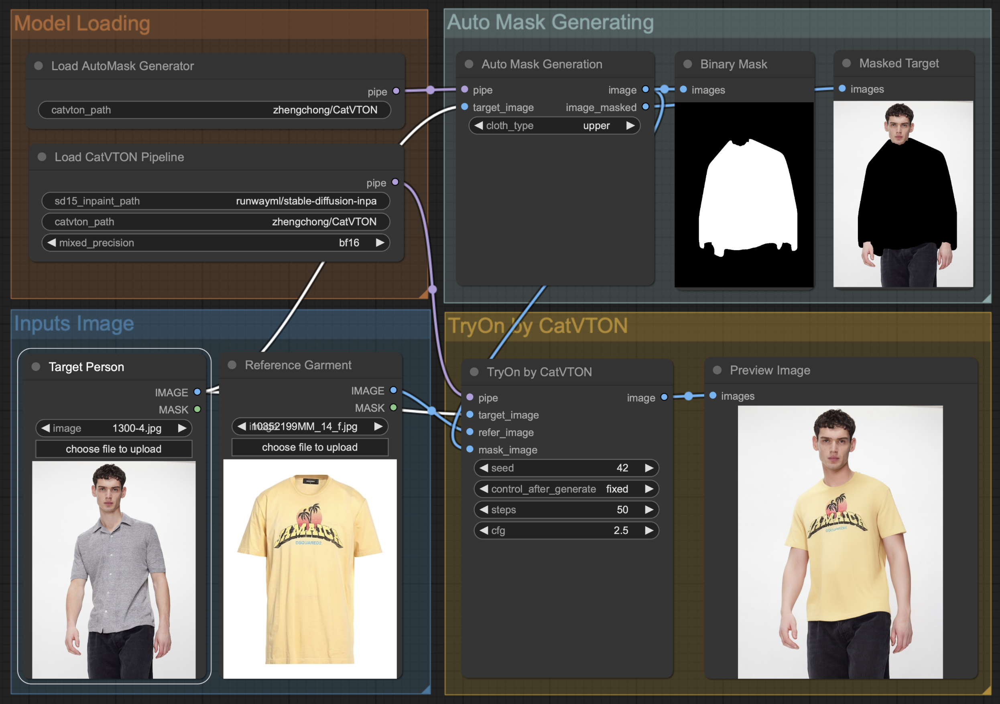
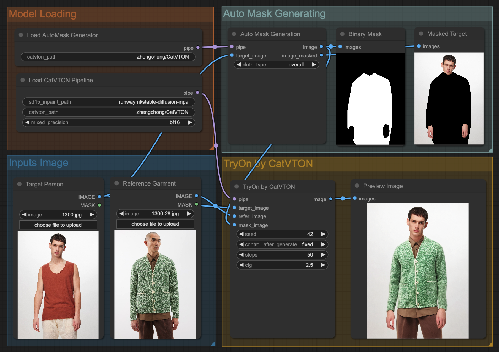

## Installation

Create a conda environment & Install requirments
```shell
conda create -n catvton python==3.9.0
conda activate catvton
cd CatVTON-main  # or your path to CatVTON project dir
pip install -r requirements.txt
```
# Docker run
# docker build -t tryon-gpu-app .
# docker run -v "D:\RK:/workspace/" --gpus all -p 8000:8000 --name tryon-container tryon-gpu-app

## Deployment 
### ComfyUI Workflow
 [Releases](https://github.com/Zheng-Chong/CatVTON/releases/tag/ComfyUI), the code placed under `custom_nodes` of ComfyUI and our workflow JSON files.

To deploy CatVTON to your ComfyUI, follow these steps:
1. Install all the requirements for both CatVTON and ComfyUI, refer to [Installation Guide for CatVTON](https://github.com/Zheng-Chong/CatVTON/blob/main/INSTALL.md) and [Installation Guide for ComfyUI](https://github.com/comfyanonymous/ComfyUI?tab=readme-ov-file#installing).
2. Download [`ComfyUI-CatVTON.zip`](https://github.com/Zheng-Chong/CatVTON/releases/download/ComfyUI/ComfyUI-CatVTON.zip) and unzip it in the `custom_nodes` folder under your ComfyUI project (clone from [ComfyUI](https://github.com/comfyanonymous/ComfyUI)).
3. Run the ComfyUI.
4. Download [`catvton_workflow.json`](https://github.com/Zheng-Chong/CatVTON/releases/download/ComfyUI/catvton_workflow.json) and drag it into you ComfyUI webpage and enjoy 😆!

When you run the CatVTON workflow for the first time, the weight files will be automatically downloaded, usually taking dozens of minutes.

<div align="center">
  
</div>

<!-- <div align="center">
 
</div> -->

### Gradio App

To deploy the Gradio App for CatVTON on your machine, run the following command, and checkpoints will be automatically downloaded from HuggingFace.

```PowerShell
CUDA_VISIBLE_DEVICES=0 python app.py \
--output_dir="resource/demo/output" \
--mixed_precision="bf16" \
--allow_tf32 
```
When using `bf16` precision, generating results with a resolution of `1024x768` only requires about `8G` VRAM.

## Inference
### 1. Data Preparation
Before inference, you need to download the [VITON-HD](https://github.com/shadow2496/VITON-HD) or [DressCode](https://github.com/aimagelab/dress-code) dataset.
Once the datasets are downloaded, the folder structures should look like these:
```
├── VITON-HD
|   ├── test_pairs_unpaired.txt
│   ├── test
|   |   ├── image
│   │   │   ├── [000006_00.jpg | 000008_00.jpg | ...]
│   │   ├── cloth
│   │   │   ├── [000006_00.jpg | 000008_00.jpg | ...]
│   │   ├── agnostic-mask
│   │   │   ├── [000006_00_mask.png | 000008_00.png | ...]
...
```

```
├── DressCode
|   ├── test_pairs_paired.txt
|   ├── test_pairs_unpaired.txt
│   ├── [dresses | lower_body | upper_body]
|   |   ├── test_pairs_paired.txt
|   |   ├── test_pairs_unpaired.txt
│   │   ├── images
│   │   │   ├── [013563_0.jpg | 013563_1.jpg | 013564_0.jpg | 013564_1.jpg | ...]
│   │   ├── agnostic_masks
│   │   │   ├── [013563_0.png| 013564_0.png | ...]
...
```
For the DressCode dataset, we provide script to preprocessed agnostic masks, run the following command:
```PowerShell
CUDA_VISIBLE_DEVICES=0 python preprocess_agnostic_mask.py \
--data_root_path <your_path_to_DressCode> 
```

### 2. Inference on VTIONHD/DressCode
To run the inference on the DressCode or VITON-HD dataset, run the following command, checkpoints will be automatically downloaded from HuggingFace.

```PowerShell
CUDA_VISIBLE_DEVICES=0 python inference.py \
--dataset [dresscode | vitonhd] \
--data_root_path <path> \
--output_dir <path> 
--dataloader_num_workers 8 \
--batch_size 8 \
--seed 555 \
--mixed_precision [no | fp16 | bf16] \
--allow_tf32 \
--repaint \
--eval_pair  
```
### 3. Calculate Metrics

After obtaining the inference results, calculate the metrics using the following command: 

```PowerShell
CUDA_VISIBLE_DEVICES=0 python eval.py \
--gt_folder <your_path_to_gt_image_folder> \
--pred_folder <your_path_to_predicted_image_folder> \
--paired \
--batch_size=16 \
--num_workers=16 
```

-  `--gt_folder` and `--pred_folder` should be folders that contain **only images**.
- To evaluate the results in a paired setting, use `--paired`; for an unpaired setting, simply omit it.
- `--batch_size` and `--num_workers` should be adjusted based on your machine.


